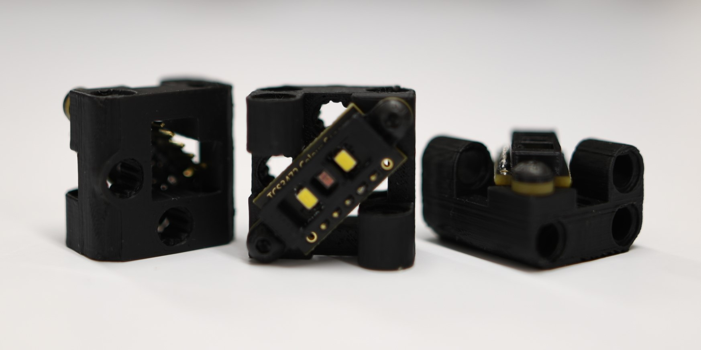
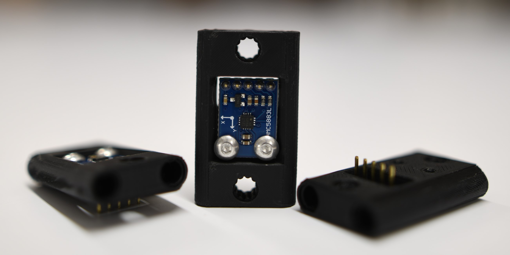
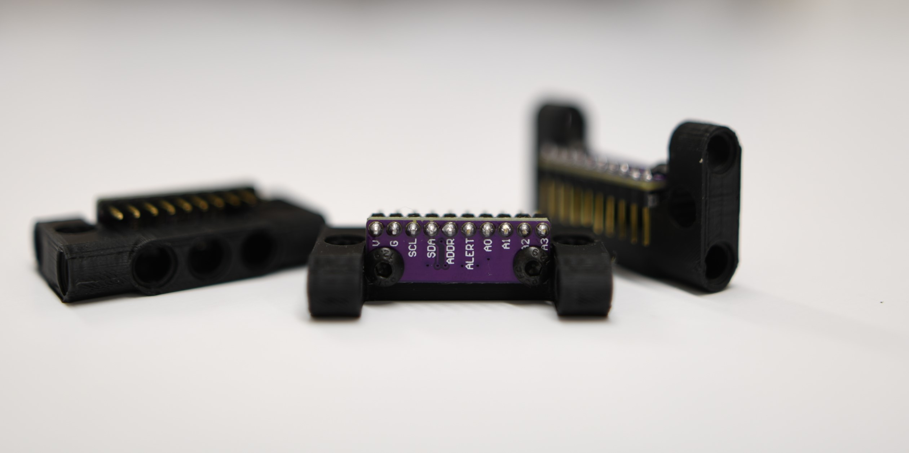
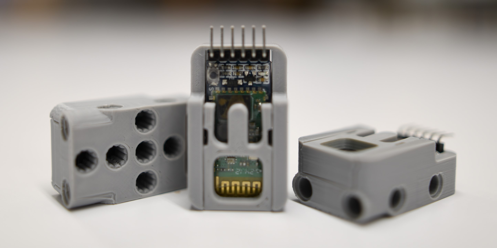

Standard Peripherals
=====================

What are Standard Peripherals?
------------------------------

As EVN Alpha is built on the RP2040 microcontroller (also used in the Raspberry Pi Pico), it supports many
common and/or open communication protocols such as GPIO (General Purpose Input/Output), I2C, UART, SPI and more.

These standard communication protocols are how sensor boards from Adafruit, Pololu and Sparkfun can work with microcontroller boards made by others (e.g. Teensy, Raspberry Pi Pico, Arduino).

However, most sensor boards do not connect to LEGO® TECHNIC® components out of the box (although mounting solutions can be 3D-printed). 
Additionally, while the wide selection of hardware is very exciting, programming or even getting them to work can often be less "plug-and-play" and more involved.

While we want to encourage users to explore the large variety of possibilities out there, Standard Peripherals are our offerings for those who
want something closer to a "plug-and-play" experience, coming with LEGO® TECHNIC® compatible mounts, first-party documentation and library support.

.. note:: While EVN Alpha supports up to 400kHz I2C, it requires some extra code to work with I2C peripherals from 3rd parties (but not too much, we promise). Look at this `guide`_ to find out how! 

.. _guide: ../guides/third-party-i2c.html

Port Types
----------

EVN Alpha has 4 types of peripheral ports:

=========  ===============
Port Type  Number of Ports
I2C        16
Serial     2
Servo      4
Motor      4
=========  ===============

Motor ports are used solely for LEGO® MINDSTORMS® motors or brushed DC gearmotors, so none of the Standard Peripherals plug into those.

However, unlike LEGO® MINDSTORMS® kits where all sensors use the same port, different Standard Peripherals use different kinds of ports (I2C, Serial or Servo). 
Refer to the table below to find out what kind of port each Peripheral uses.

Cables
-------

Standard Peripherals each come with a cable to connect to Alpha.
    * Peripherals which use I2C or Serial Ports have 4-Wire cables
    * Peripherals which use Servo Ports have 3-Wire cables
    * The 270 Degree Servo and Continuous Servo Peripherals come with non-removable 3-Wire cables.

At one end of the cable, all the wires will be joined into one plastic connector. 
With the exception of the Servo Peripherals, this connector plugs into the EVN Alpha brick, and has a notch to avoid being plugged in reverse (called a **key**).
The wire colours are also colour-coded to match the pin layout of the ports on EVN Alpha.

On the other end of the cable, each wire is separated from the others. They all need to be connected to the Peripheral, but they're not joined together
because the layout of the pins differs with each Peripheral.

The library reference page for each Peripheral (linked below) contains a pin layout section to guide you on the connections.

The pins we used on the Alpha and Standard Peripherals are standard 2.54mm pitch pin headers, and the cables can be substituted with 2.54mm Dupont jumper wires as well! 
Jumper cables don't have a key, so you'll need to be slightly more careful, but they will work perfectly. Likewise, our cables will function well for interfacing with non-Standard Peripherals if they also 2.54mm pitch pins.

Wiring
--------

Generally speaking, all peripherals have a VCC pin and GND pin.

In order to supply power to these peripherals, the GND pin on the peripheral should be connected to a GND pin on the controller (EVN Alpha) and the VCC pin on the peripheral should be connected to a voltage output on the controller (depending on the peripheral, this could be a 3.3V or 5V pin).

As for the data pins, each communication protocol is wired in a different manner:

I2C
"""""

.. list-table::
   :widths: 25 25 50
   :header-rows: 1

   * - Colour
     - Pin
     - Description
   * - Red
     - 3V3
     - 3.3V Power
   * - Black
     - GND
     - Ground
   * - Yellow
     - SCL
     - Serial Clock
   * - Blue
     - SDA
     - Serial Data

I2C is wired such that the SDA pin of the host (EVN Alpha) is connected to the SDA pin of a peripheral, and the same goes for the SCL pins.

Serial Wiring
"""""""""""""""""""

.. list-table::
   :widths: 25 25 50
   :header-rows: 1

   * - Colour
     - Pin
     - Description
   * - Red
     - 3V3
     - 3.3V Power
   * - Black
     - GND
     - Ground
   * - Yellow
     - RX
     - Transmit
   * - Blue
     - TX
     - Receive

Serial UART is wired such that the Transmit (TX) pin of the peripheral connects to the Receive (RX) pin of the host, and vice versa (TX of one always connects to RX of the other).

Servo Wiring
"""""""""""""""""""

.. list-table::
   :widths: 25 25 50
   :header-rows: 1

   * - Colour
     - Pin
     - Description
   * - Yellow
     - SIG
     - Signal
   * - Red
     - 5V
     - 5V Power
   * - Black
     - GND
     - Ground

The Servo ports only have one Signal pin, so as long as the signal pins on both peripheral and host are connected, you're all good.

List of Standard Peripherals
----------------------------

.. csv-table:: Sensors
  :align: center
  :file: ../tables/standard-peripherals/sensors.csv
  :widths: 50, 30, 10, 10
  :header-rows: 1

.. csv-table:: Displays
  :align: center
  :file: ../tables/standard-peripherals/displays.csv
  :widths: 50, 30, 10, 10
  :header-rows: 1

.. csv-table:: Actuators
  :align: center
  :file: ../tables/standard-peripherals/actuators.csv
  :widths: 50, 30, 10, 10
  :header-rows: 1

.. csv-table:: Others
  :align: center
  :file: ../tables/standard-peripherals/others.csv
  :widths: 50, 30, 10, 10
  :header-rows: 1

.. note:: There are more actuator software classes for the LEGO® MINDSTORMS® EV3 and NXT motors (``EVNMotor``, ``EVNDrivebase``), which are of course fully compatible despite not being Standard Peripherals.

.. |gesture.JPG| image:: ../images/standard-peripherals/gesture.JPG

.. _EVNColourSensor: ../sensors/EVNColourSensor.html
.. _EVNDistanceSensor: ../sensors/EVNDistanceSensor.html
.. _EVNCompassSensor: ../sensors/EVNCompassSensor.html
.. _EVNIMUSensor: ../sensors/EVNIMUSensor.html
.. _EVNGestureSensor: ../sensors/EVNGestureSensor.html
.. _EVNEnvSensor: ../sensors/EVNEnvSensor.html
.. _EVNTouchArray: ../sensors/EVNTouchArray.html
.. _EVNDisplay: ../sensors/EVNDisplay.html
.. _EVNMatrixLED: ../sensors/EVNMatrixLED.html
.. _EVNSevenSegmentLED: ../sensors/EVNSevenSegmentLED.html
.. _EVNRGBLED: ../sensors/EVNRGBLED.html
.. _EVNServo: ../sensors/EVNServo.html
.. _EVNContinuousServo: ../sensors/EVNContinuousServo.html
.. _EVNAnalogMux: ../sensors/EVNAnalogMux.html
.. _EVNBluetooth: ../sensors/EVNBluetooth.html